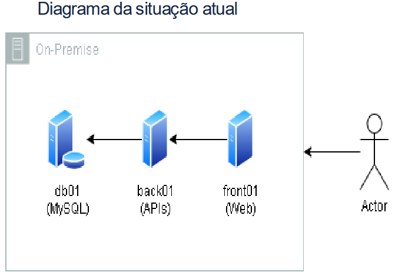
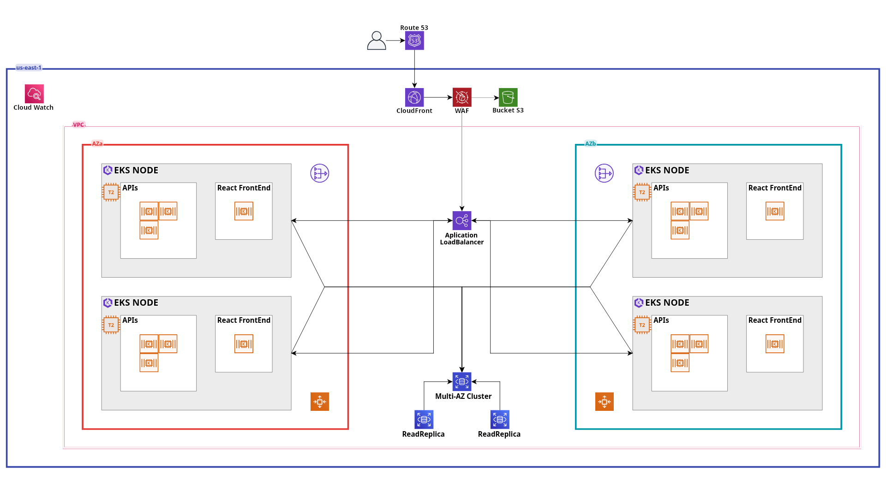

# FAQ do Projeto

Bem-vindo à seção de **Perguntas Frequentes (FAQ)** do nosso projeto. Aqui, você encontrará respostas diretas e objetivas para as questões levantadas pela **Compass**, abordando os principais aspectos técnicos e funcionais do desenvolvimento.

Nosso objetivo é fornecer esclarecimentos detalhados sobre as decisões de arquitetura, tecnologias utilizadas, funcionalidades implementadas e demais requisitos solicitados. Caso precise de informações adicionais, entre em contato com a equipe responsável pelo projeto.

---

# ETAPA AS IS

## Quais as ferramentas vão ser utilizadas?

AWS MGN

AWS DMS

AWS-EC2

AWS-ALB

AWS-RDS

AWS-S3

CloudWatch

NAT

EKS

## Qual o diagrama da empresa atual?

## Qual o diagrama da infraestrutura na AWS?

## Como serão garantidos os requisitos de Segurança?

- **AWS IAM**: Configure usuários e permissões de acesso.
- **AWS WAF**: Proteja o aplicativo contra ataques como SQL Injection e XSS.
- **CloudWatch**: Monitore logs, métricas e eventos do ambiente AWS, configurando alarmes para detectar atividades suspeitas ou falhas no sistema.
- **Security Groups**: Controle o tráfego permitido para as instâncias EC2.
- **AWS Key Management Service (KMS)**: Utilize o KMS para gerenciar chaves de criptografia de forma segura, protegendo dados sensíveis armazenados em S3, RDS, EBS, e outros serviços.

## Quais atividades são necessária para a migração?

As etapas de migração estão resumidas abaixo para facilitar o entendimento do processo. Cada etapa contém uma visão geral das atividades envolvidas. Para mais detalhes, links específicos estão disponíveis ao longo da documentação, proporcionando uma explicação mais aprofundada de cada fase. Recomendamos a leitura dos links para um melhor acompanhamento.

### Migração de Servidores e APIs para AWS EC2 com Application Migration Service

Este processo detalha os passos para a migração de servidores utilizando o **AWS Application Migration Service** (MGN). Ele envolve a instalação do agente de replicação, sincronização dos dados, testes de aceitação e a execução do cutover final para garantir uma transição segura e eficiente para a infraestrutura da AWS.

1. Inicializar o AWS Application Migration Service na região de destino.
2. Instalar o AWS Replication Agent no servidor de origem.
3. Aguardar a conclusão da sincronização inicial. Após instalar o agente, é necessário aguardar a conclusão do processo de sincronização inicial, que realiza a replicação em nível de bloco do servidor de origem para o servidor de replicação na área de preparação.
4. Lançar instâncias de teste. Após a sincronização inicial, é possível iniciar uma máquina de destino no Modo de Teste, permitindo a realização de testes de aceitação e a verificação do funcionamento correto do ambiente migrado.
5. Realizar testes de aceitação nos servidores. Após testar com sucesso a instância de teste, finalize o teste e exclua a instância.
6. Configurar ações pós-lançamento (se necessário).
7. Aguardar a janela de cutover.
8. Confirmar que não há atraso (lag).
9. Parar todos os serviços operacionais no servidor de origem.
10. Lançar uma instância de cutover. Iniciar a máquina de destino no Modo de Cutover, iniciando o processo final de migração.
11. Confirmar que a instância de cutover foi lançada com sucesso e, em seguida, finalizar o cutover.
12. Arquivar o servidor de origem.

### Banco de dados on-premise para RDS

>Link de acesso a documentação oficial 💡
>[Set up replication for AWS Database Migration Service](https://docs.aws.amazon.com/dms/latest/userguide/CHAP_GettingStarted.Replication.html)

## Como será realizado o processo de Backup?

- O RDS realiza backups contínuos do banco de dados dentro do período de retenção configurado.
- Os arquivos estáticos armazenados no S3 são versionados e seguem um ciclo de vida.

## Qual o custo da infraestrutura na AWS (AWS Calculator)?

### Migração

- Custos da migração do banco de dados (72 horas de uso t3.large)
    - 10.51 USD
- Custos de armazenamento
    - 57.50 USD

### Estrutura

- Custo mensal
    - 504.22 USD
- Custo total anual
    - 6,050.64 USD

>Link de acesso ao orçamento na AWS (March 15, 2025) 💡
>[My Estimate - AWS](https://calculator.aws/#/estimate?id=934bc019249d8f441fd11dabf67c648a8cb619b5)

---

## ETAPA 2: MODERNIZAÇÃO COM KUBERNETES

## Quais atividades são necessária para a migração?

### 1. Converter estrutura em microserviços docker

- **Identificar componentes do sistema** (ex: backend, frontend, banco de dados, autenticação).
- **Separar funcionalidades monolíticas** em serviços independentes.
- **Criar imagens Docker** para cada serviço.
- **Publicar as imagens** no **Amazon ECR** (Elastic Container Registry).

### **2. Preparar o Cluster Kubernetes**

- Criar um **Cluster EKS** no AWS Management Console ou via CLI.
- Configurar **VPC, sub-redes e Auto Scaling** para os Worker Nodes.

### **Segurança e Configurações Adicionais**

- Configurar **IAM roles** para permissões do EKS.
- Implementar **AWS WAF e Security Groups** para proteção.

## Quais as ferramentas vão ser utilizadas?

AWS MGN

AWS DMS

AWS-EC2

AWS-ALB

AWS-RDS

AWS-S3

CloudWatch

NAT

EKS

CloudFront

ECR

## Qual o diagrama da infraestrutura na AWS?

(2).png)

## Como serão garantidos os requisitos de Segurança?

- **AWS IAM**: configura usuários e permissões de acesso.
- **AWS WAF**: protege o aplicativo contra ataques como SQL Injection e XSS.
- **CloudWatch**: monitora logs, métricas e eventos do ambiente AWS, configurando alarmes para detectar atividades suspeitas ou falhas no sistema.
- **Security Groups**: controla o tráfego permitido para as instâncias EC2, restringir o tráfego externo para o cluster.
- **AWS Key Management Service (KMS)**: gerencia chaves de criptografia de forma segura, protegendo dados sensíveis armazenados em S3, RDS, EBS, e outros serviços.

Visando que o projeto esta em produção, será adicionado camadas extras de proteção e segurança:

Segurança de Containers e Kubernetes:  

- **PodSecurity Policies e RBAC**: Controla o acesso e as permissões de execução dentro do cluster Kubernetes, assegurando que os pods tenham as permissões mínimas e evitando o uso de práticas inseguras (como containers executando como root).
- **Escaneamento de Imagens de Containers (Trivy, Clair)**: Assegura que as imagens de containers estejam livres de vulnerabilidades conhecidas antes de serem implantadas no Kubernetes.

**Ameaças Internas e Zero Trust**

- **Network Policies no Kubernetes**: Implemente políticas de rede para garantir que apenas os pods autorizados possam comunicar entre si. Isso minimiza os riscos de movimento lateral em caso de comprometimento de um pod.
- **Segurança de API (API Gateway + Rate Limiting)**: Proteja suas APIs com um **API Gateway**, implemente **rate limiting** para evitar abuso e **autenticação/autorização** (OAuth, JWT).

**Segurança de Rede**

- **AWS Shield (Proteção contra DDoS)**: Ative o AWS Shield para proteger suas aplicações de ataques de negação de serviço distribuída (DDoS).
- **VPC com subnets privadas**: Configure sua infraestrutura de rede de forma que os componentes sensíveis (como bancos de dados) fiquem em subnets privadas e inacessíveis diretamente pela internet.

## Como será realizado o processo de Backup?

- O RDS realiza backups contínuos do banco de dados dentro do período de retenção configurado.
- Os arquivos estaticos armazenados no S3 serão versionados e seguirão um ciclo de vida

## Qual o custo da infraestrutura na AWS (AWS Calculator)?

- Custo mensal
    - 977.84 USD
- Custo total anual
    - 11,734.08 USD

>[My Estimate - AWS](https://calculator.aws/#/estimate?id=1deb627dd7529d6a7b4e341042305ca2bb0cd456)
>Link de acesso ao orçamento na AWS (March 15, 2025) 💡

## Conclusão

---

## Navegação

### 🚀 Modernização
- [Kubernetes Moderno](doc/modern/modern_k8s.md)
- [Setup e Técnicas](doc/modern/step_tecnicas.md)

### 🔄 Migração
- [Visão Geral](doc/migration/migration_overview.md)
- [Migração de Banco de Dados](doc/migration/migration_bd.md)
- [Migração para EC2](doc/migration/migration_ec2.md)
- [Migração de Arquitetura Estática para ARM](doc/migration/static_arm.md)

### 🔒 Segurança
- [Segurança na AWS](doc/security_aws.md)

### ❓ FAQ
- [Perguntas Frequentes](doc/faq.md)

### 📚 Documentação Completa
- [Ver Documento Completo](doc/full_doc.md)
